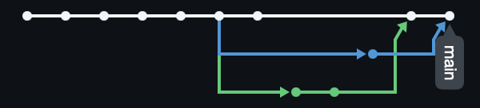

# Booking Service

Учебный проект по дисциплине «Введение в DevSecOps».
Сервис бронирования: демонстрация Git workflow — репозиторий → коммиты → ветки → merge → конфликт.

## Структура
- README.md
- project-notes.md
- api-plan.md
- git-conflict.md
- git-network.png

## Граф веток

